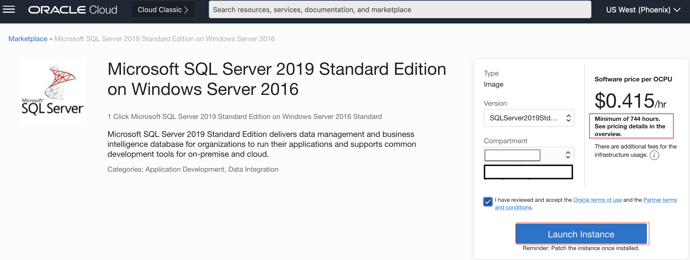
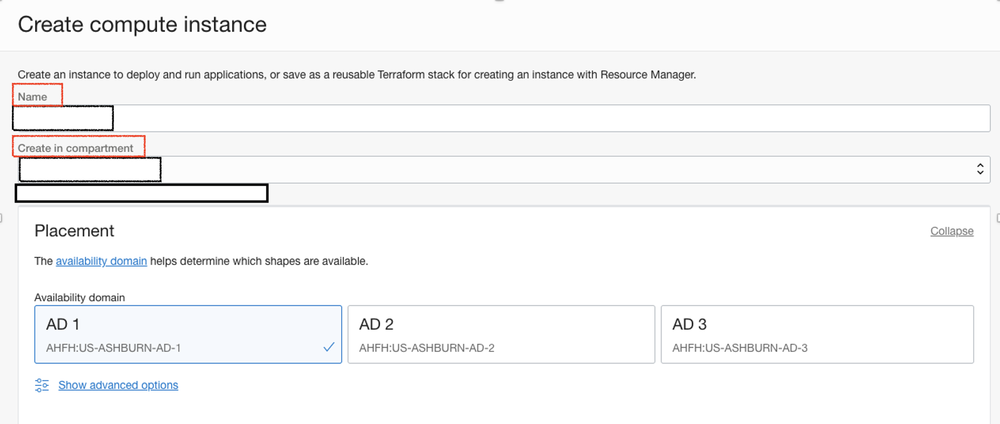

# Provision the Compute Instance from Market Place Image for SQL Server 2019

## Introduction

This lab walks you through the steps how to provision the Microsoft SQL Server 2019 from the Market Place Image in compute instance.

Estimated Time:  15 Minutes

### Objectives
In this lab, you will learn to :
* Deploy the Microsoft SQL Server 2019 from marketplace image
* Add the Computer Instances to Active Directory Domain Controller

### Prerequisites  

This lab assumes you have:
- A Free or LiveLabs Oracle Cloud account
- IAM policies to create resources in the compartment
- Required Subnets are available in VCN

##  Task 1: Provision the SQL Server 2019 from Market Place for Node1

1. Open the navigation menu, click **Marketplace**, and then click **All Applications**

  

2. Marketplace All Applications will be shown as below. Search for **SQL Server 2019** image and select the desired edition of SQL Server. We have Enterprise and Standard Edition are available.  Always On Basic Availability Groups provide a high availability solution for SQL Server from version 2016 and above on Standard Edition. A basic availability group supports a failover environment for a single database in Standard Edition.  

  

3. Choose the compartment and click on **Launch Instance**, the screen will be taken to the launch compute instance.

  

### Note: Please note that Minimum of 744 hours will be charged for SQL Server Marketplace image.

4. Choose the Instance name and compartment where the compute instance needs to create, select the desired Availability Domain.

  

5. Click on **Change shape** to select the shape of the instance.

  

6. Choose the compartment where the compute instance should resides, and then choose the private subnet as shown in below image.

  

7. Choose the default values an click on **Create** instance
  

8. Once the compute instance provisioning completed, we could able to see the instance state is running.

    

  You may now **proceed to the next lab.**
## Learn More
- You can find more information about Launching a Windows Instance [here](https://docs.oracle.com/en-us/iaas/Content/GSG/Tasks/launchinginstanceWindows.htm)

## Acknowledgements
* **Author** - Devinder Pal Singh, Senior Cloud Engineer, NA Cloud Engineering
* **Contributors** -  Ramesh Babu Donti, Principal Cloud Architect, NA Cloud Engineering
* **Last Updated By/Date** - Devinder Pal Singh, Senior Cloud Engineer, NA Cloud Engineering, June 2022
