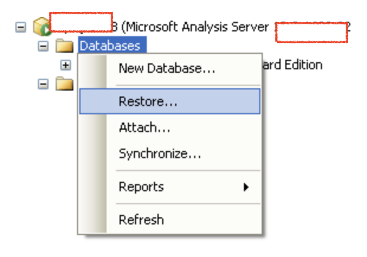
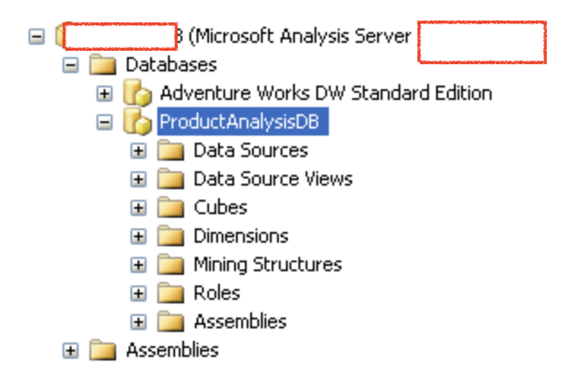

# Connect to SQL Server Analysis Service and Restore the Database from Backup

## Introduction

This lab walks you through the steps of how to create a Windows bastion host and set up the Windows Active Directory Domain Services in Compute instance. It involves creating the windows bastion host and Windows server in Compute instance and installing and configuring the Microsoft Active Directory Domain Services.

Estimated Time:  1 Hour

### Objectives
In this lab, you will learn to :
* How to Restore the SSAS database from Backup.

### Prerequisites  

This lab assumes you have:
- A Free or LiveLabs Oracle Cloud account
- IAM policies to create resources in the compartment
- Required Subnets are available in VCN

##  Task 1: Copy the SSAS DB Backup to the SSAS default Backup location.

1. Copy the backup file which we downloaded in Lab2: Task1 to the below default location.

    C:\Program Files\Microsoft SQL Server\MSAS15.MSSQLSERVER\OLAP\Backup

    Note: This is the default location where we can keep the backups.
## Task 2:  Restore the SSAS Database from SQL Server Management Studio.

1. Connect to SQL Server Management Studio as **Admin** and connect to SQL Server Analysis Services. To restore the SSAS database, right-click on the SSAS database in the Object Explorer window of SSMS, and select Restore.

  

2. Select the location of the Backup file and click OK

  

3. Once the Analysis Service database is successfully restored, it looks like the below:

  

  Note: It will take some time to restore the Database depending upon the backup size.

## Acknowledgements
* **Author** - Devinder Pal Singh, Senior Cloud Engineer, NA Cloud Engineering
* **Contributors** - Ramesh Babu Donti, Principal Cloud Architect, NA Cloud Engineering
* **Last Updated By/Date** - Devinder Pal Singh, Senior Cloud Engineer, NA Cloud Engineering, June 2022
